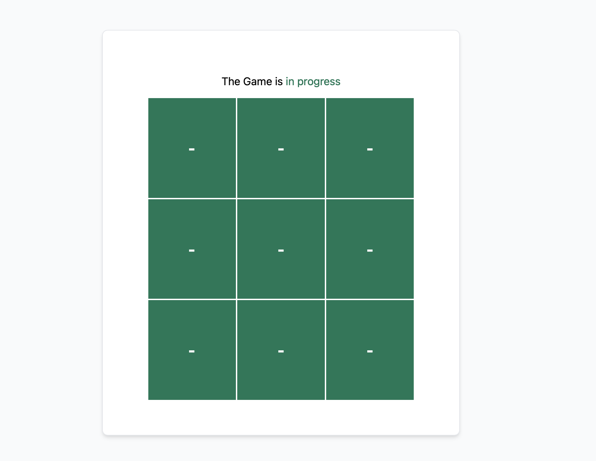

<h1>Tic Tac Toe App</h1>

This application is created in order to give a way to start in React with typescript with some good tips.

<h2> How to install the app</h2>
<hr/>

```
git clone https://github.com/ShekMak/tic-tac-toe
```
Clone the app in your computer and get in the folder created for to test and upgrade features of this sample app.

```
yarn add
```

Add the project dependencies by running the above code in the folder of this sample application. This will allow you to run the project without problems.

<h2>How to run the App</h2>
<hr/>

```
yarn install
```

Runs the app in the development mode.\
Open [http://localhost:3000](http://localhost:3000) to view it in the browser.

The page will reload if you make edits.\
You will also see any lint errors in the console.


<br/>

<h2>License</h2>
<hr/>

This project is licensed under the MIT License.


<h2>Follow me on</h2>
<hr/>

- [Twitter](https://twitter.com/tshiokufila)<br/>
- [LinkedIn](https://www.linkedin.com/in/shekinahtshiokufila/)
